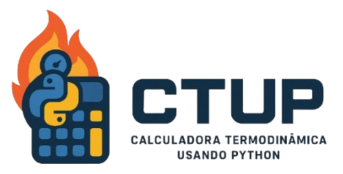

<h1 align='center'>
  CTUP: Facilitando os cálculos termodinâmicos</a>
</h1>

  

<h2>Projeto Final da Disciplina de Prática em Ciência de Dados</h2> 
Instituição de ensino vinculada aos desenvolvedores e colaboradores do Projeto: Ilum Escola de Ciência - CNPEM (Centro Nacional de Pesquisa em Energia e Materiais)

    

<h2>Descrição do projeto</a></h2>

 Este projeto é uma calculadora simples para transformações termodinâmicas. Ela pode calcular calor, trabalho, variação da energia interna e da entropia em um gás monoatômico ideal a partir de uma sequência de pontos, cada um com pressão, volume e temperatura determinados. Além disso, ela retorna um gráfico P x V de cada uma das transformações e o rendimento de ciclos.

 A calculadora admite apenas transformações isotérmicas, isométricas ou isobáricas. 

<h2>Aviso de licença</h2>
Todos são livres para utilizar e modificar os códigos deste repositório, mas desde que sejam dados os devidos créditos.

<h2>Quer um guia mais detalhado sobre o Projeto? </h2>
Confira no pdf a seguir, desenvolvido especialmente para você!

<h2>Como posso rodar o Projeto na minha máquina?</h2>

- Passo 1: clonar o repositório ou baixar arquivo zip
- Passo 2: instalar biblioteca `matplotlib.pyplot`, pelo comando `pip install matplotlib` no terminal
- Passo 3: instalar biblioteca `tkinter`, pelo comando `pip install tk` no terminal
- Passo 4: rodar arquivo `main.py`

<h2>Desenvolvedores do Projeto</a></h2>
<ul>
  <li>Caio Ávila Paulo (https://github.com/Caio1833): idealizador do Projeto e responsável pelo arquivo calculaNpontos.py</li>
  <li>Lázaro Santana Ribeiro (https://github.com/lazaroribeiro): responsável pelo arquivos.py e relatório</li>
  <li>Mariana Melo Pereira (https://github.com/marip864): responsável pelo arquivo main.py e fluxo de funcionamento da aplicação</li>
  <li>Samarah Luiza de Medeiros Ramos (https://github.com/SamarahRamos): responsável pelo arquivo graficos.py</li>
</ul>

<h2>Professores Responsáveis</a></h2>
<ul>
  <li>Prof. Dr. Daniel Roberto Cassar (https://github.com/drcassar)</li>
  <li>Prof. Dr. James Moraes de Almeida (https://github.com/jamesmalmeida)</li>
  <li>Prof. Dr. Leandro Nascimento Lemos (https://github.com/llemos)</li>
</ul>
